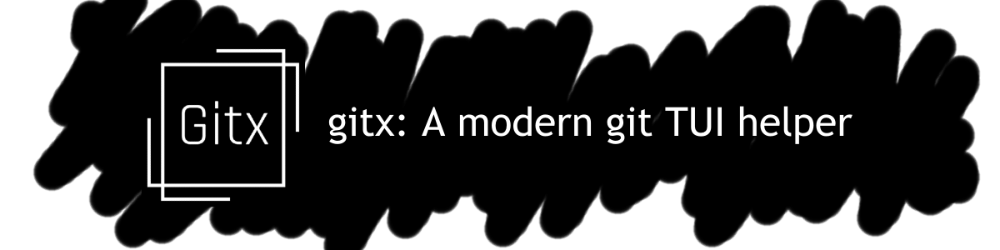

# :material-desktop-classic: gitx

A powerful Terminal User Interface for Git, built with Python and Textual.

## :material-star: Overview

**gitx** simplifies Git operations through an intuitive terminal interface, making version control more accessible and efficient. Navigate repositories, manage branches, view diffs, and commit changes—all without leaving your terminal.

No more memorizing complex Git commands or struggling with merge conflicts. gitx provides a visual, keyboard-driven interface that makes Git operations intuitive and efficient.

## :material-creation: Features

-   :material-source-repository: **Repository Management**

    -   Browse repository structure
    -   View file history
    -   Track changes across commits

-   :material-source-branch: **Branch Operations**

    -   Create and switch branches
    -   Visualize branch structure
    -   Manage remote branches

-   :material-compare: **Diff Visualization**

    -   See changes in a clear, visual format
    -   Navigate through changes easily
    -   Understand complex diffs

-   :material-merge: **Merge & Conflict Resolution**
    -   Interactive merge workflow
    -   Visual conflict resolution
    -   Simplified rebasing

## :material-rocket: Getting Started

-   :material-download: [**Installation**](installation.md)

    -   Set up gitx on your system

-   :material-book-open-variant: [**Basic Usage**](usage/getting-started.md)

    -   Learn the fundamentals

-   :material-school: [**Tutorial**](tutorial/introduction.md)

    -   Comprehensive guide to Git with gitx

-   :material-frequently-asked-questions: [**FAQs**](tutorial/introduction.md)
    -   Common questions answered

## :material-image: Preview

<figure markdown>
  
  <figcaption>gitx interface showing repository status, branch view, and diff panel</figcaption>
</figure>

## :material-developer-board: Project Status

This project is currently in development. We're working hard to bring you the best Git experience in the terminal.

-   :material-bug: [**Report an Issue**](https://github.com/gitxtui/gitx/issues/new)

    -   Help us improve by reporting bugs

-   :material-source-pull: [**Contribute**](contributing/guidelines.md)
    -   Join our development effort

